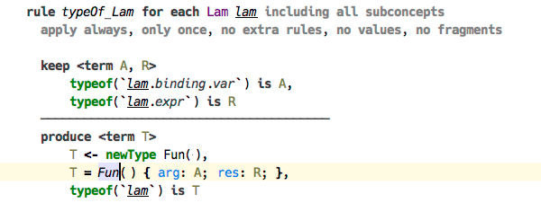

### Constraint Rules

In this section we’ll take a brief look at our implementation of programming with constraint rules. The approach we take here is heavily influenced by Constraint Handling Rules (CHR) and in particular JCHR. We focus on implementing the semantics of CHR, so we leave the concrete syntax out of the picture, and also extend the semantics with alternative body branches and support for logical variables. The process of solving the constraint rules is carried out with the help of a custom engine.

#### Constraints and predicates

Constraints and predicates are the basic building blocks of a constraint rules program (they are also called «user constraints» and «built-in constraints» respectively). Essentially a constraint is a named n-tuple, with parameters being arbitrary objects — except constraints themselves. The only requirement for a constraint is that its arity must remain the same at all usage sites. Predicates are, simply put, statements about zero, one, or more objects, that can be either asserted (told) or queried (asked). One can think of predicate as a pair of static methods, named «tellSth» and «askSth». In essence, a predicate invocation is a binding of the predicate with its parameters, which invokes either one of these two methods depending on which context it is called from. The «told» method of a predicate can potentially activate other predicates or bind logical variables. In contrast, the «ask» method is required to be side effects free. Examples of predicates are unification and equality.

In the following example the selected line shows a unification predicate depicted as `=` sign. On the left hand side there is a logical variable `T`, and on the right hand side is a term constructor corresponding to «Fun» type.

#### Logical variables

The discussion on predicates touches another important topic: logical variables. These exist to facilitate indirection, meaning, in particular, that we can make assertions about something we don’t yet know. Or we can pass an instance of a logical variable to a constraint and receive the result of a computation through it. Equality predicate, when activated via the «told» interface, binds logical variables, and so does the unification predicate, but the latter also binds the logical variables that are potentially contained within the terms passed as parameters. Two logical variables that are matched with equality or unification predicate are joined, and essentially become one variable: they are either both unbound or both assigned the same value.

Using a logical variable to capture a sub-term of the type term that is expected to have a certain form (a function type in this instance) serves as a good example. In the following example, we expect the logical variable `FI` to have a form of «Fun» type and we capture the argument and the result types to the variables `FA` and `FR`, respectively. 

> Here `FI` is unified with a term containing unbound logical variables (defined at the start of the block) for the «arg» and «res» slots. On successful unification the variables get assigned the values contained in the corresponding slots in the term referred to by `FI`.  

#### Structure of constraint rules program

A program is composed of handlers, which are containers of constraint rules. Every rule consists of three parts: the head, the guard, and the body. The head contains a configuration of constraints that trigger this rule, and also determines what happens with these constraints when the rule is triggered: whether they are kept or discarded. The guard consists of an optional list of predicates that control whether the rule should be triggered. Finally, the body contains a list of constraints and predicates that are activated when the rule is triggered. There is a possibility to declare an alternative branch in the body, which gets activated if the main branch fails, and can be used to recover and to report errors. Finally, there is a possibility to call arbitrary code from both the guard and the body of a constraint rule. 

> The block following «else» keyword in the «produce» section of the rule gets executed if any of the constraints or predicates in the main branch fails. Here we call a static method `Util.formatError`, which assigns the logical variable `E` the error string, and then activate the constraint `error/2`, which attaches the error to the AST node `ite`. 

#### Constraint lifecycle

Once activated, a constraint enters the first phase of its lifecycle. The engine starts looking for appropriate rules that can be triggered by this constraint. Other constraints from the store can be used to fill the slots of a multi-head rule. The constraint stays active unless the rule that is triggered declares that constraint to be discarded, in which case it is the end of life for it. Otherwise, next rule is tried and so on, until there are no matching rules, and the constraint becomes inactive, but is still kept alive in the store in a dormant state. An inactive constraint can be awaken if some of the logical variables that serve as its parameters become bound, and in this case the process is the same as with newly activated constraint. 

A constraint activated from the body of a rule is immediately processed, with any constraints that are activated as a result also processed recursively in their own turn, which makes the semantics of evaluating a program similar to calling regular Java methods. In fact, any Java code executed from a rule’s body is able to activate a constraint or a predicate, this allows easy integration of auxiliary code into a constraint rules program.
