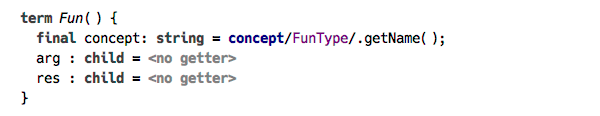

### Introduction

In order to manipulate with types as objects we need to introduce an appropriate data structure. The «SNode»  used in the AST representation is just too heavyweight to be suitable for computation, so we created a data structure that is equivalent to a term as it is usually defined in theoretic discussions on types. This data structure is immutable, any change results in creating a new instance of a term. The key feature of the term data structure is that it is a perfect fit for unification. 

#### A digression on terms and unification

<blockquote>

A term is usually defined as an object that can be either a constant or a function of several arguments, each of which being a term as well. In addition to that, a term may also be a variable ranging over terms. So, for example, `a`, `b`, `f(g h)`, and `X` are all terms, where lowercase letters represent function or constant symbols, and uppercase letters are for variables. 

Unification is the process of finding a substitution for variables, called «unifier», that make two terms equal. For example, a substitution `[X→a]` is a unifier for two terms `f(a)` and `f(X)`, whereas the terms `g(Y b)` and `g(c d)` can’t be unified, because `b≠d`. 

</blockquote>

With terms representing types we can use the unification to find the values for type variables, and thus infer the type. This idea is the basis for a type inference algorithm known as «Hindley-Milner», which is applied widely in languages based on lambda calculus. 

We introduce logical variables as a model for referencing a value that is computed later, and allow terms to have logical variables as child terms. These are the same logical variables that can be used as parameters to constraints, which enables us to create constraints on types that have not yet been instantiated, meaning logical variables can be used to represent type variables. 

<blockquote>
The source code to the samples presented here are available online, see the links at the end of the article.
</blockquote>

The language of typing rules makes it easy to declare and use the logical variables. They are declared  at the start of a rule block, just like type variables declared at the start of a Java method. 

The key we discuss here is the use of constraint rules to implement type checking and type inference. The typing rules, which constitute the essence of the algorithm, are recorded in form of templates that are applied to the source AST nodes. It is worth emphasising that, in contrast to the classic approach to building a type system with MPS, the typing rules are not executed immediately on being triggered, but rather produce instances of constraint rules. These rules are collected into handlers, according to the way they are organised in the type checking aspect, so the order of constraint rules activation is predictable. The handlers constitute a constraint rules program, which is then executed, and the results are produced in form of constraints representing inferred types and detected errors.

Constraints serve to express facts about types, which can be used to check type correctness or implement type inference. The way it works looks very much like the theoretic typing rules work: the rule head defines the antecedent, and the rule body is the consequent. Once we «know» all the inputs to the rule, we can make a conclusion. The structure of the constraint rule allows us to freely manipulate the facts: we can keep the ones that we are interested in and throw away those that are no longer needed. In effect, constraint rules constitute a simple but powerful apparatus for logic programming. 

