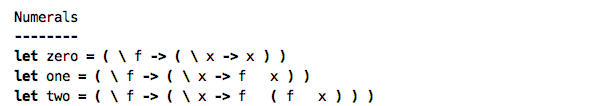
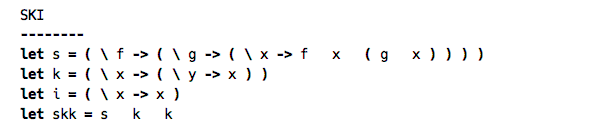
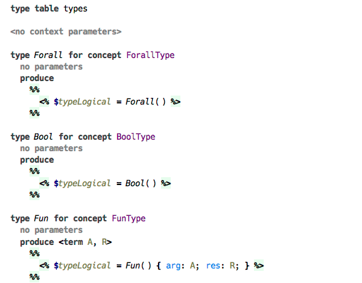
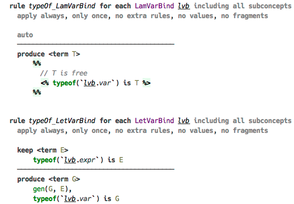
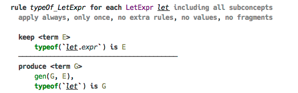
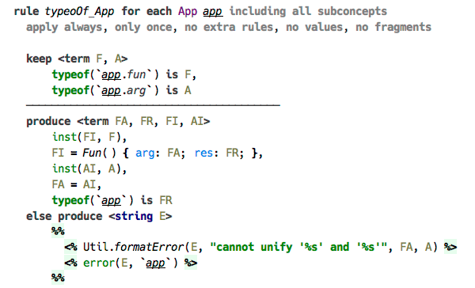
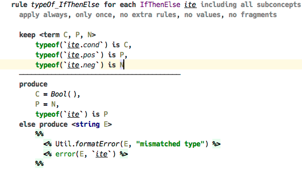

### Lambda Calculus

We now approach the main topic of this article: the lambda calculus language and how we implement type checking and type inference for this language. This version of lambda calculus is created for demonstration only, but it has all the features required from a complete language. The visual notation is similar to the one used by Haskell, in fact the code from our language can be simply pasted to ghci and evaluated. 

Here is a few samples of the code created with our language.






#### Structure

We present the language structure in a kind of quasi-BNF, the full structure is available in the MPS model. The following representation omits a few details about the language structure and only serves to illustrate the discussion. 

```
Program ::= LetClause | Program

LetClause ::= "let" Var "=" Expr

Expr ::= App | Lam | Let | Var | Const | IfThenElse | "fix"

App ::= Expr Expr

Lam ::= "\" Var "->" Expr

Let ::= "let" Var "=" Expr "in" Expr

Var ::= identifier

Const ::= "true" | "false"

IfThenElse ::= "if" Expr "then" Expr "else" Expr

Type ::= "bool" | Fun | Forall

Fun ::= Type "->" Type

Forall ::= "forall." Type
```

The expressions of the language are limited to lambda abstraction, function application, let expression, variable reference, and fix operator. The only constants are `true` and `false`. The types are: function type and `forall`, the only primitive type being `bool`.

A program is a sequence of let clauses. These define variable bindings that are available for use in subsequent clauses. A let expression defines a variable that can be referred to from within the expression that follows `in` keyword. A variable bound by the lambda abstraction is accessible within its body. Although here we use the nonterminal `Var` for both declaration and usage sites, in real life there are two variants of `Var` — the declaration and the reference. We thusly delegate the resolving of variable names to scopes defined in the «Constraints» aspect of the language, and get rid of the necessity to pass typing context down the inference rules. 

The rest of the definition should be self-explanatory. One important thing that is missing here are the type annotations. This is not anything we specifically avoid, it’s simply not implemented yet. So, the `Type` production isn’t really used in the language, since all types are inferred, but rather exists to enable the recovery of types from their term representation back into the AST form.
    
#### Type Checking and Type Inference

Finally we arrive directly at discussing the typing rules. We now show how the artefacts defined in the type checking aspect are used to build the type system for lambda calculus. There are four kinds of «roots» in the language: the constraints and terms are declared in constraint table and term table respectively, type initialisers are contained in a type table, and finally the typing rules are defined in handlers. The latter may belong to one of several stages, which basically allow to separate the type checking process into two or more chained phases, where the next phase is launched as soon as the previous one has finished.

**TODO: type terms declaration and use**

The typing rules for our language use a number of constraints, which we describe here briefly. The two constraints `gen` and `inst` comprise a pair of complementary functions that either wrap a function type into a forall type, thus introducing a generic function type, or unwrap a forall, instantiating new function type with fresh type variables. The `error` constraint is used to report type checking errors, whereas `typeNode` constraint binds a calculated «SNode» type representation to a location in the source program. This representation is built with the help of the constraints `recover` and `varname`, which are used by the typing rules in the second stage of the type checking, when all type inference rules have been processed. 

Two constraints that are used everywhere in the typing rules that are worth separate discussion, are `typeof` and `newtype`. The former is a usual constraint that has a special representation defined in the language, and its purpose is to bind a term representing the type to a location in the program. Whereas the latter is a «pseudo-constraint», which triggers  invocation of type initialiser, also defined in the same aspect. Following are the type initialisers for lambda calculus. Their purpose is simply to bind a suitable term to the type variable `$typeLogical` using unification predicate. In more complicated scenarios, the type initialiser can also do additional stuff, such as creating other constraints. The reason these initialisers exist in this form is to support automatic creation of type terms from the type annotations coming from the source program, with the help of another pseudo-constraint `asType`. This design is currently open to discussion and may probably be replaced with regular constraint rules in the future.



The only predicate that is used in typing rules that follow, is the unification predicate, displayed as `=`. Its purpose is simply to run a unification of the two terms and, if used in the body of a rule, assign the logical variables that are found in the terms on either side of the operator. In case unification fails, either the predicate returns false or an exception is raised — depending on which part of the rule it is used in.

#### Typing rules
     
Now let’s take a look at typing rules for each part of the language that plays a role in type inference. We give a short explanation for every rule. All rules have predefined structure: the head and optional guard are above the line separating them from the body below the line. The body is composed of at least one branch, which may be empty itself. A head-less rule is marked «auto», indicating that the rule is triggered automatically, whereas a rule with an empty body produces no activations of either constraints or predicates. Thus, a rule without a body only makes sense if there are constraints declared in the head of the rule that are discarded. Each rule is either declared to be standalone, or corresponds to a specific concept. Consequently, a typing rule produces either exactly a single instance of a constraint rule, or as many rules as there are instances of this concept in the source program.

The typing rules for `true` and `false` are straightforward: they both assign a type Bool to the constant.


The two typing rules for variable declaration. First, a variable declared by the lambda abstraction: all that this rule is saying is that the type of the variable is assigned a fresh type variable. Next, a variable declared by let expression: its type  simply gets assigned the type that is inferred for the corresponding expression.



The typing rule for let expression itself is a bit tricky: we need to wrap the resulting type into forall, thus making a generic type. This is done with `gen` constraint activated from the body.



The typing rule for variable reference. Here we unwrap forall type with `inst` constraint, so that the type of the variable reference gets assigned a new instance of the generic type.


The type of a lambda abstraction is assigned a new term corresponding to the function type, with argument type substituted with the type of the variable, and the result type with the inferred type of the body. 


      
Perhaps the most interesting is the typing rule for function application. Once the types of both the «left» and «right» expressions are known, both of them are instantiated with `inst` constraint, then the instantiated «left» type is unified with a term corresponding to a function type, capturing two new type variables: the argument type and the result type. The result type becomes the type of the application expression, and the argument type is unified with the previously instantiated «right» type. 

The body part here contains an alternative branch — this exists to handle an error that may have occurred in the main branch. Thus the type inference doesn’t stop at a first error, but instead records an error and carries on. 



For `if-then-else` expression we only check that the type of the condition expression is `bool`, and both branches have types that are unifiable. The type of the whole expression is the result of unification of both branches’s types.



The typing rule for `Fix` expression is quite straightforward, assigning its type a term described with this simplified notation: `forall. (A -> A) -> A`, where `A` is a fresh type variable. 


   
The second stage, dealing with recovery of the type terms and converting them into the more conventional AST form is not so interesting, so we omit it here to save space. The rules in this stage are triggered as soon as the initial stage — the one where the type inference is done — is finished, meaning there are no more active constraints to process. All the rules here are activated by the constraint `typeof` and produce the constraint `typeNode` after appropriate conversion. 

