# Type Checking Lambda Calculus with Constraint Rules

## A primer on the upcoming feature of JetBrains MPS

#### by Fedor Isakov

Implementing type checking and type inference in JetBrains Meta Programming System has long been quite a challenge for language authors. Although MPS provides solid support for some basic scenarios, there are just too many corner cases that sometimes require construction of an ad hoc solution. We present a redesigned type checking subsystem that addresses many issues with the existing design, and we believe should make writing custom type systems much more straightforward.


### Overview

This article serves as a brief account of using the new approach to type checking that is currently being developed. The contents should be accessible to anyone familiar with MPS and type checking in general. If you are interested in what’s going on in the area of type checking, and you would like to have better understanding of the new approach that we take to address the problem, this article is for you. Also, we are interested in what you think, so please send your feedback. 

We explain how the redesigned type checking infrastructure for MPS works. We introduce term as the data structure to represent types, we discuss unification and what role it plays in type inference, what are logical variables and how they can be used as type variables, and finally how programming with constraints is applicable to type checking. 

In this article we will show how to build type system for simply typed lambda calculus in MPS. Type checking and type inference is a very complex topic, so we select a rather naive example to demonstrate how a fundamental type inference algorithm can be implemented using our new set of languages designed from scratch to address this problem.

The key idea we discuss here is the use of Constraint Logic Programming, or constraint rules, to drive the type inference logic. We use generative approach, with type checking templates defining the typing rules that get transformed into constraint rules, which are finally evaluated to produce the resulting set of constraints containing inferred types and errors detected in the process. 


### Introduction

In order to manipulate with types as objects we need to introduce an appropriate data structure. The «SNode»  used in the AST representation is just too heavyweight to be suitable for computation, so we created a data structure that is equivalent to a term as it is usually defined in theoretic discussions on types. This data structure is immutable, any change results in creating a new instance of a term. The key feature of the term data structure is that it is a perfect fit for unification. 

#### A digression on terms and unification

> A term is usually defined as an object that can be either a constant or a function of several arguments, each of which being a term as well. In addition to that, a term may also be a variable ranging over terms. So, for example, `a`, `b`, `f(g h)`, and `X` are all terms, where lowercase letters represent function or constant symbols, and uppercase letters are for variables. 

> Unification is the process of finding a substitution for variables, called «unifier», that make two terms equal. For example, a substitution `[X→a]` is a unifier for two terms `f(a)` and `f(X)`, whereas the terms `g(Y b)` and `g(c d)` can’t be unified, because `b≠d`. 

With terms representing types we can use the unification to find the values for type variables, and thus infer the type. This idea is the basis for a type inference algorithm known as «Hindley-Milner», which is applied widely in languages based on lambda calculus. 

We introduce logical variables as a model for referencing a value that is computed later, and allow terms to have logical variables as child terms. These are the same logical variables that can be used as parameters to constraints, which enables us to create constraints on types that have not yet been instantiated, meaning logical variables can be used to represent type variables. 

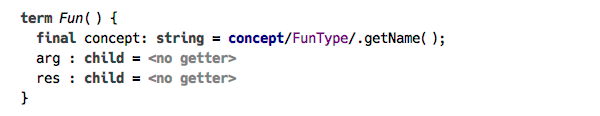

> The source code to the samples presented here are available online, see the links at the end of the article.

The language of typing rules makes it easy to declare and use the logical variables. They are declared  at the start of a rule block, just like type variables declared at the start of a Java method. 

The key we discuss here is the use of constraint rules to implement type checking and type inference. The typing rules, which constitute the essence of the algorithm, are recorded in form of templates that are applied to the source AST nodes. It is worth emphasising that, in contrast to the classic approach to building a type system with MPS, the typing rules are not executed immediately on being triggered, but rather produce instances of constraint rules. These rules are collected into handlers, according to the way they are organised in the type checking aspect, so the order of constraint rules activation is predictable. The handlers constitute a constraint rules program, which is then executed, and the results are produced in form of constraints representing inferred types and detected errors.

Constraints serve to express facts about types, which can be used to check type correctness or implement type inference. The way it works looks very much like the theoretic typing rules work: the rule head defines the antecedent, and the rule body is the consequent. Once we «know» all the inputs to the rule, we can make a conclusion. The structure of the constraint rule allows us to freely manipulate the facts: we can keep the ones that we are interested in and throw away those that are no longer needed. In effect, constraint rules constitute a simple but powerful apparatus for logic programming. 

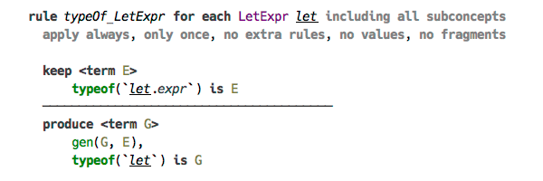


### Constraint Rules

In this section we’ll take a brief look at our implementation of programming with constraint rules. The approach we take here is heavily influenced by Constraint Handling Rules (CHR) and in particular JCHR. We focus on implementing the semantics of CHR, so we leave the concrete syntax out of the picture, and also extend the semantics with alternative body branches and support for logical variables. The process of solving the constraint rules is carried out with the help of a custom engine.

#### Constraints and predicates

Constraints and predicates are the basic building blocks of a constraint rules program (they are also called «user constraints» and «built-in constraints» respectively). Essentially a constraint is a named n-tuple, with parameters being arbitrary objects — except constraints themselves. The only requirement for a constraint is that its arity must remain the same at all usage sites. Predicates are, simply put, statements about zero, one, or more objects, that can be either asserted (told) or queried (asked). One can think of predicate as a pair of static methods, named «tellSth» and «askSth». In essence, a predicate invocation is a binding of the predicate with its parameters, which invokes either one of these two methods depending on which context it is called from. The «told» method of a predicate can potentially activate other predicates or bind logical variables. In contrast, the «ask» method is required to be side effects free. Examples of predicates are unification and equality.

In the following example the selected line shows a unification predicate depicted as `=` sign. On the left hand side there is a logical variable `T`, and on the right hand side is a term constructor corresponding to «Fun» type.


#### Logical variables

The discussion on predicates touches another important topic: logical variables. These exist to facilitate indirection, meaning, in particular, that we can make assertions about something we don’t yet know. Or we can pass an instance of a logical variable to a constraint and receive the result of a computation through it. Equality predicate, when activated via the «told» interface, binds logical variables, and so does the unification predicate, but the latter also binds the logical variables that are potentially contained within the terms passed as parameters. Two logical variables that are matched with equality or unification predicate are joined, and essentially become one variable: they are either both unbound or both assigned the same value.

Using a logical variable to capture a sub-term of the type term that is expected to have a certain form (a function type in this instance) serves as a good example. In the following example, we expect the logical variable `FI` to have a form of «Fun» type and we capture the argument and the result types to the variables `FA` and `FR`, respectively. 

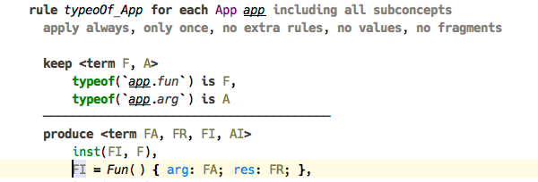

> Here `FI` is unified with a term containing unbound logical variables (defined at the start of the block) for the «arg» and «res» slots. On successful unification the variables get assigned the values contained in the corresponding slots in the term referred to by `FI`.  

#### Structure of constraint rules program

A program is composed of handlers, which are containers of constraint rules. Every rule consists of three parts: the head, the guard, and the body. The head contains a configuration of constraints that trigger this rule, and also determines what happens with these constraints when the rule is triggered: whether they are kept or discarded. The guard consists of an optional list of predicates that control whether the rule should be triggered. Finally, the body contains a list of constraints and predicates that are activated when the rule is triggered. There is a possibility to declare an alternative branch in the body, which gets activated if the main branch fails, and can be used to recover and to report errors. Finally, there is a possibility to call arbitrary code from both the guard and the body of a constraint rule. 

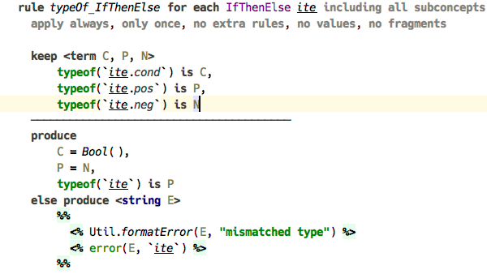

> The block following «else» keyword in the «produce» section of the rule gets executed if any of the constraints or predicates in the main branch fails. Here we call a static method `Util.formatError`, which assigns the logical variable `E` the error string, and then activate the constraint `error/2`, which attaches the error to the AST node `ite`. 

#### Constraint lifecycle

Once activated, a constraint enters the first phase of its lifecycle. The engine starts looking for appropriate rules that can be triggered by this constraint. Other constraints from the store can be used to fill the slots of a multi-head rule. The constraint stays active unless the rule that is triggered declares that constraint to be discarded, in which case it is the end of life for it. Otherwise, next rule is tried and so on, until there are no matching rules, and the constraint becomes inactive, but is still kept alive in the store in a dormant state. An inactive constraint can be awaken if some of the logical variables that serve as its parameters become bound, and in this case the process is the same as with newly activated constraint. 

A constraint activated from the body of a rule is immediately processed, with any constraints that are activated as a result also processed recursively in their own turn, which makes the semantics of evaluating a program similar to calling regular Java methods. In fact, any Java code executed from a rule’s body is able to activate a constraint or a predicate, this allows easy integration of auxiliary code into a constraint rules program.


### Lambda Calculus

We now approach the main topic of this article: the lambda calculus language and how we implement type checking and type inference for this language. This version of lambda calculus is created for demonstration only, but it has all the features required from a complete language. The visual notation is similar to the one used by Haskell, in fact the code from our language can be simply pasted to ghci and evaluated. 

Here is a few samples of the code created with our language.


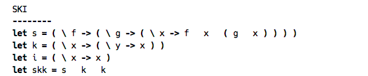

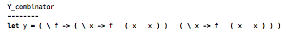

#### Structure

We present the language structure in a kind of quasi-BNF, the full structure is available in the MPS model. The following representation omits a few details about the language structure and only serves to illustrate the discussion. 

```
Program ::= LetClause | Program

LetClause ::= "let" Var "=" Expr

Expr ::= App | Lam | Let | Var | Const | IfThenElse | "fix"

App ::= Expr Expr

Lam ::= "\" Var "->" Expr

Let ::= "let" Var "=" Expr "in" Expr

Var ::= identifier

Const ::= "true" | "false"

IfThenElse ::= "if" Expr "then" Expr "else" Expr

Type ::= "bool" | Fun | Forall

Fun ::= Type "->" Type

Forall ::= "forall." Type
```

The expressions of the language are limited to lambda abstraction, function application, let expression, variable reference, and fix operator. The only constants are `true` and `false`. The types are: function type and `forall`, the only primitive type being `bool`.

A program is a sequence of let clauses. These define variable bindings that are available for use in subsequent clauses. A let expression defines a variable that can be referred to from within the expression that follows `in` keyword. A variable bound by the lambda abstraction is accessible within its body. Although here we use the nonterminal `Var` for both declaration and usage sites, in real life there are two variants of `Var` — the declaration and the reference. We thusly delegate the resolving of variable names to scopes defined in the «Constraints» aspect of the language, and get rid of the necessity to pass typing context down the inference rules. 

The rest of the definition should be self-explanatory. One important thing that is missing here are the type annotations. This is not anything we specifically avoid, it’s simply not implemented yet. So, the `Type` production isn’t really used in the language, since all types are inferred, but rather exists to enable the recovery of types from their term representation back into the AST form.
    
#### Type Checking and Type Inference

Finally we arrive directly at discussing the typing rules. We now show how the artefacts defined in the type checking aspect are used to build the type system for lambda calculus. There are four kinds of «roots» in the language: the constraints and terms are declared in constraint table and term table respectively, type initialisers are contained in a type table, and finally the typing rules are defined in handlers. The latter may belong to one of several stages, which basically allow to separate the type checking process into two or more chained phases, where the next phase is launched as soon as the previous one has finished.

The terms that define types in the language are collected in a term table. Each term contains zero, one, or more «features», which can be an atomic data type or a «child» term. A special kind of feature is a «list», designed to contain an arbitrary number of child terms. 

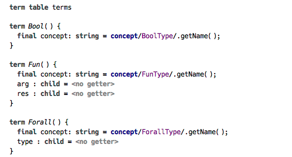

The typing rules for our language use a number of constraints, which we describe here briefly. The two constraints `gen` and `inst` comprise a pair of complementary functions that either wrap a function type into a forall type, thus introducing a generic function type, or unwrap a forall, instantiating new function type with fresh type variables. The `error` constraint is used to report type checking errors, whereas `typeNode` constraint binds a calculated «SNode» type representation to a location in the source program. This representation is built with the help of the constraints `recover` and `varname`, which are used by the typing rules in the second stage of the type checking, when all type inference rules have been processed. 

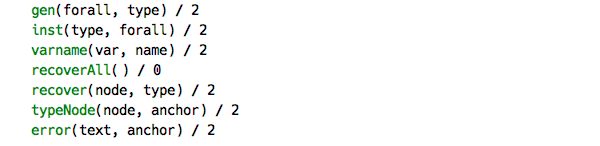

Two constraints that are used everywhere in the typing rules that are worth separate discussion, are `typeof` and `newtype`. The former is a usual constraint that has a special representation defined in the language, and its purpose is to bind a term representing the type to a location in the program. Whereas the latter is a «pseudo-constraint», which triggers  invocation of type initialiser, also defined in the same aspect. Following are the type initialisers for lambda calculus. Their purpose is simply to bind a suitable term to the type variable `$typeLogical` using unification predicate. In more complicated scenarios, the type initialiser can also do additional stuff, such as creating other constraints. The reason these initialisers exist in this form is to support automatic creation of type terms from the type annotations coming from the source program, with the help of another pseudo-constraint `asType`. This design is currently open to discussion and may probably be replaced with regular constraint rules in the future.

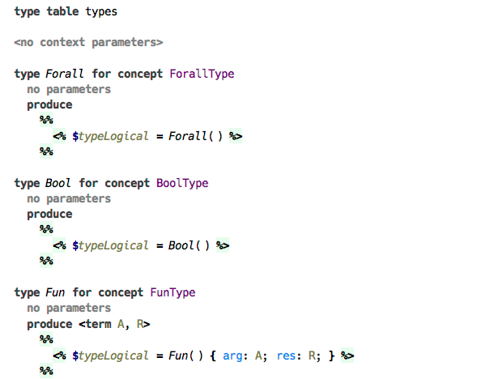

The only predicate that is used in typing rules that follow, is the unification predicate, displayed as `=`. Its purpose is simply to run a unification of the two terms and, if used in the body of a rule, assign the logical variables that are found in the terms on either side of the operator. In case unification fails, either the predicate returns false or an exception is raised — depending on which part of the rule it is used in.

#### Typing rules
     
Now let’s take a look at typing rules for each part of the language that plays a role in type inference. We give a short explanation for every rule. All rules have predefined structure: the head and optional guard are above the line separating them from the body below the line. The body is composed of at least one branch, which may be empty itself. A head-less rule is marked «auto», indicating that the rule is triggered automatically, whereas a rule with an empty body produces no activations of either constraints or predicates. Thus, a rule without a body only makes sense if there are constraints declared in the head of the rule that are discarded. Each rule is either declared to be standalone, or corresponds to a specific concept. Consequently, a typing rule produces either exactly a single instance of a constraint rule, or as many rules as there are instances of this concept in the source program.

The typing rules for `true` and `false` are straightforward: they both assign a type Bool to the constant.


The two typing rules for variable declaration. First, a variable declared by the lambda abstraction: all that this rule is saying is that the type of the variable is assigned a fresh type variable. Next, a variable declared by let expression: its type  simply gets assigned the type that is inferred for the corresponding expression.

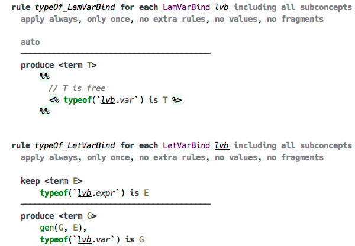

The typing rule for let expression itself is a bit tricky: we need to wrap the resulting type into forall, thus making a generic type. This is done with `gen` constraint activated from the body.

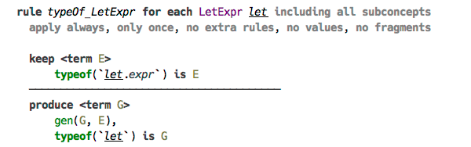

The typing rule for variable reference. Here we unwrap forall type with `inst` constraint, so that the type of the variable reference gets assigned a new instance of the generic type.

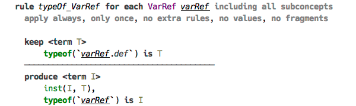

The type of a lambda abstraction is assigned a new term corresponding to the function type, with argument type substituted with the type of the variable, and the result type with the inferred type of the body. 

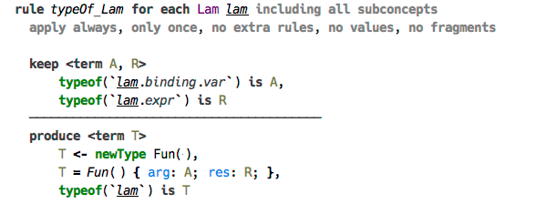
      
Perhaps the most interesting is the typing rule for function application. Once the types of both the «left» and «right» expressions are known, both of them are instantiated with `inst` constraint, then the instantiated «left» type is unified with a term corresponding to a function type, capturing two new type variables: the argument type and the result type. The result type becomes the type of the application expression, and the argument type is unified with the previously instantiated «right» type. 

The body part here contains an alternative branch — this exists to handle an error that may have occurred in the main branch. Thus the type inference doesn’t stop at a first error, but instead records an error and carries on. 


For `if-then-else` expression we only check that the type of the condition expression is `bool`, and both branches have types that are unifiable. The type of the whole expression is the result of unification of both branches’s types.


The typing rule for `Fix` expression is quite straightforward, assigning its type a term described with this simplified notation: `forall. (A -> A) -> A`, where `A` is a fresh type variable. 

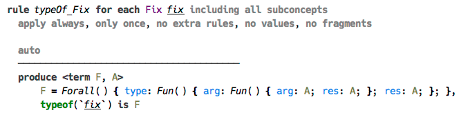
   
The second stage, dealing with recovery of the type terms and converting them into the more conventional AST form is not so interesting, so we omit it here to save space. The rules in this stage are triggered as soon as the initial stage — the one where the type inference is done — is finished, meaning there are no more active constraints to process. All the rules here are activated by the constraint `typeof` and produce the constraint `typeNode` after appropriate conversion. 


### Conclusion

In this article we have given a short summary of constraints-based approach to type checking that is the foundation of an upcoming major feature of JetBrains MPS. We have shown how this approach can be applied to solving a classic type inference problem in simply typed lambda calculus. This solution can be easily extended to support type annotations, and further to introduce subtyping and ADTs. A similar approach can be applied to solving  type inference in more conventional languages, such as Java. The author is currently working on re-implementing type checking for Base Language and its extensions, while keeping compatibility with Java and providing full support for solving type relations.

The method of solving constraints generated from the source code is not only relevant to type checking. One can imagine running all kinds of model validation using this technique, which is why we are planning to make the framework of building constraint rules as generic and as flexible as possible to allow for future reuse. 

We omit here the details of the implementation and the inner mechanics of constraint rules generation and handling, as this should be a topic for an in-depth discussion. All the source code is available online, so anyone interested in the details can take a look. 

### Acknowledgements

Non-exhaustive list of materials used for implementation of this feature and in preparation of this article.

1. [Constraint Handling Rules](http://www.informatik.uni-ulm.de/pm/fileadmin/pm/home/fruehwirth/constraint-handling-rules-book.html) — A book by Thom Frühwirth, and also a list of CHR resources.
2. [JCHR](https://dtai.cs.kuleuven.be/CHR/JCHR/) — A Java implementation of CHR semantics.
3. Baader, Franz, and Wayne Snyder. "Unification Theory." Handbook of automated reasoning 1 (2001): 445-532.
4. Wazny, Jeremy Richard. Type inference and type error diagnosis for Hindley/Milner with extensions. University of Melbourne, Computer Software and Engineering, 2006.
5. Cardelli, Luca. "Basic polymorphic typechecking." Science of computer programming 8.2 (1987): 147-172.
6. Pierce, Benjamin C. Types and programming languages. MIT press, 2002.
7. [Write You a Haskell](http://dev.stephendiehl.com/fun/index.html) — A website by  Stephen Diehl dedicated to building a Haskell-like language.

The implementation of the type checking plugin for MPS and the sample language calculus language can be found on GitHub: 

1. [Type Checking with Constraint Rules](https://github.com/fisakov/constraints-typechecking)
2. [Demo of using the typechecking with constraint rules](https://github.com/fisakov/lambdacalc)

---
About the author: Fedor Isakov is a senior software developer at JetBrains. He can be contacted on Twitter (fisakov) or by email (fisakov *AT* gmail *DOT* com).

[](http://creativecommons.org/licenses/by-sa/4.0/)  
This work is licensed under a [Creative Commons Attribution-ShareAlike 4.0 International License](http://creativecommons.org/licenses/by-sa/4.0/)


